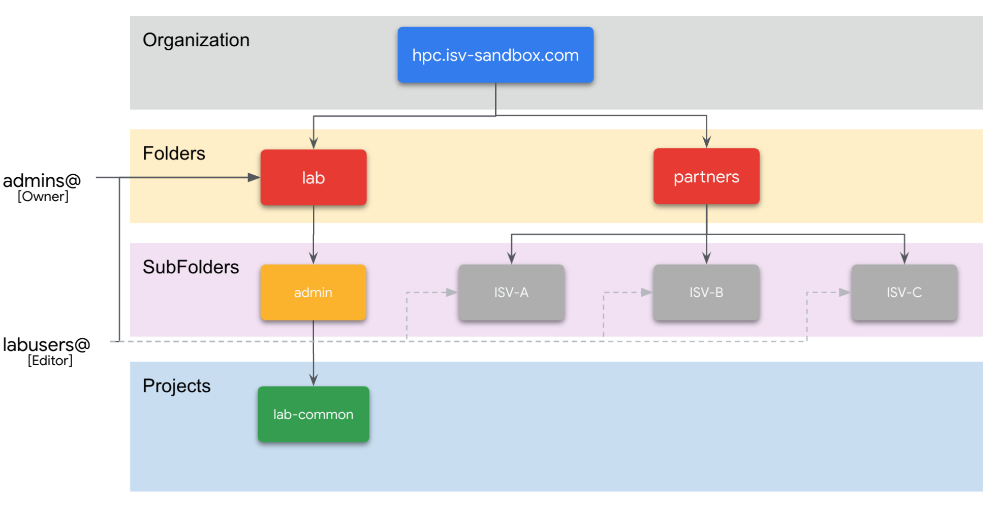
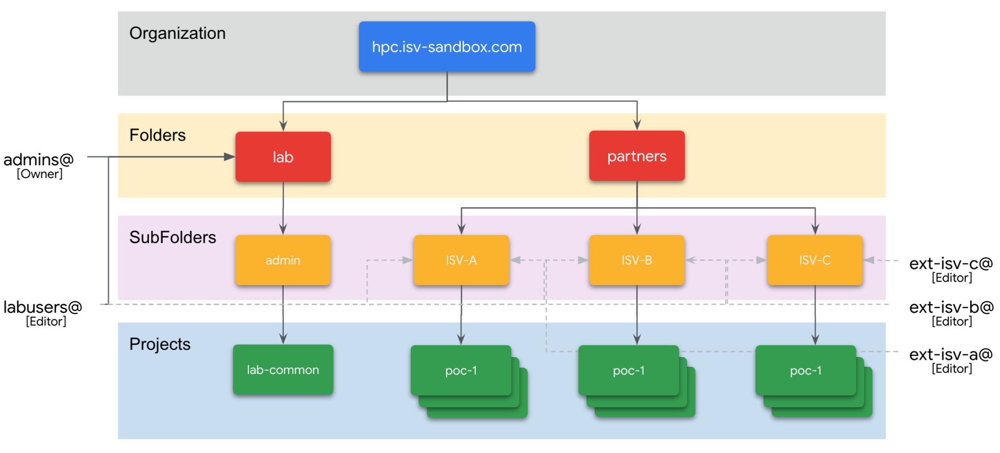
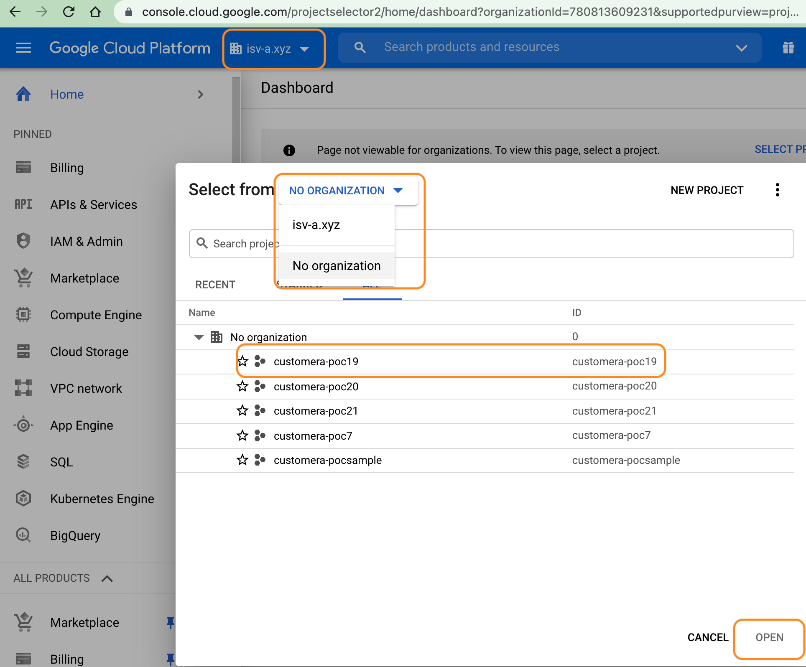
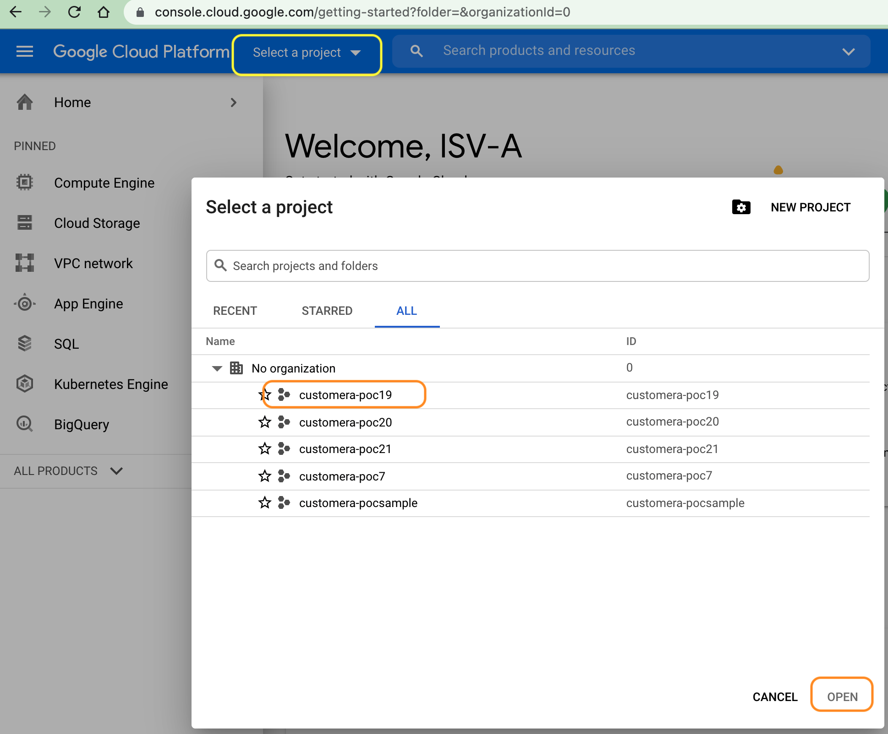

# HPC Acceleration Lab

This repo contains various infrastructure options for creating a Baseline environment for HPC workloads. This repo is used and managed by Lab Admins/users to provision new Google Cloud projects in an existing Organization.  

> :warning: This is not an officially supported Google product

> :warning: *Please note that code in this repo is provided only as an example to help
guide infrastructure planning, execute Proof of Concept (PoCs), testing and is not intended to be used in production. Infrastructure templates are deliberately simplified for clarity and lack significant details required for production-worthy infrastructure implementation.*

## Table of Contents
  - [Environment Overview](#environment)
  - [ISV Onboarding](#isv-onboarding)
    - [Cloud Build](#using-cloud-build)
	- [Terminal](#manual-deployment)
  - [ISV Onboarded](#isv-onboarded)
    - [Access ISV Project](#access-isv-proejct)
      - [ISV with Google Workspace](#isv-with-google-workspace)
      - [ISV with no Google Workspace](#isv-with-no-google-workspace)

## Environment Overview
The current setup contains a Google Cloud Organization named hpc.isv-sandbox.com with a Folder each for Lab maintainers and ISVs. 
 - `lab` contains a single sub-folder `admin` managed by Lab maintainers consisting of 2 groups of users:
   * `lab-common` is the admin project containing logic to create, configure and provision new environments for ISVs. Provisioning is fully integrated with [Cloud Build](https://cloud.google.com/build) that uses a CI/CD pipeline to onboard or update existing ISVs environments.
     * admins@ - Owner permissions
   	 * labusers@ - Editor permissions
 
 - `partners` consist of groups for each ISV:
   * ext-isv-x@ - Editor permissions for their folder. This group is created and managed from admin.google.com where external users are added. 
   * Optionally, admins@ and lab-users@ group are granted Editor permissions at the ISV folder level. Depending on the ISV needs, this access level can be revisited.


Here is an illustration of the current setup which is before onboarding any ISV.


## ISV Onboarding
Lab Admins will create a Google group in admin.google.com and add ISV email addresses. Checklist for Lab Admins:
 - [x] [Create group for ISV (isv-x.xyz)](https://cloud.google.com/iam/docs/groups-in-cloud-console#creating)
 - [x] If ISV has Google Workspace account, Email address(es) of ISV Team
 - [x] If ISV has *no* Google Workspace account, create user(s) in [admin.google.com](https://support.google.com/a/answer/33310?hl=en). Step will need any email address (work preferred) in order to receive login credentials.
 - [x] [Add members to the Group](https://cloud.google.com/iam/docs/groups-in-cloud-console#viewing-editing-details)

There are two ways to onboard ISVs to the environment:
 - Cloud Build (Recommended)
 - Manual Terraform script execution (Adhoc)
### Using Cloud Build
1. Clone the Repo
```sh
git clone https://github.com/googlestaging/hpc-lab-samples.git
cd hpc-lab-samples/infrastructure/lab-projects/
```
2. Create a new folder `customera-poc1` and copy all the contents from `sample-project` folder into `customera-poc-1`
```sh
cp -r sample-project/ customera-poc1
cd customera-poc1/
```
3. Update configuration in `terraform.tfvars` and `backend.tfvars`
```sh
# terraform.tfvars
partner_name = "customera"
sub_project = "poc1"

# backend.tfvars
prefix  = "lab/customera/poc1/full"
```
4. Update any variables/region from each block as needed
5. Update to the `cloudbuild.yaml` file and include a new block like this
    ```sh
		- id: 'tf build poc1'
				name: 'hashicorp/terraform:1.0.0'
				entrypoint: 'sh'
				waitFor: ['-']
				args: 
				- '-c'
				- |
					cd /workspace/infrastructure/lab-projects/customera-poc-1
					echo `pwd`
					terraform init -backend-config=./backend.tfvars && terraform plan
					terraform providers
					terraform validate
					terraform apply --auto-approve
					terraform output
    ```
5. `cd` back to the root of the `git` repo
6. Push changes to Git
	```sh
    git add .
    git commit -m 'creating customera-poc1'
    git push
    ```
7. CloudBuild will automatically pick it up from the ADMIN project and creates the project 

### Manual Deployment
You will need `gcloud` setup on your machine using `gcloud auth login`

1. Clone the Repo
```sh
git clone https://github.com/googlestaging/hpc-lab-samples.git
cd hpc-lab-samples/infrastructure/lab-projects/
```
2. Duplicate the `sample-project/` 
```sh
cp -r sample-project/ customera-poc1
cd customera-poc1/
```
3. Update configuration in `terraform.tfvars` and `backend.tfvars`
```sh
# terraform.tfvars
partner_name = "customera"
sub_project = "poc1"

# backend.tfvars
prefix  = "lab/customera/poc1/full"
```
4. [Optional] Update `region` and `zone` in `terraform.tfvars`
5. Run terraform and check for output
```sh 
terraform init -reconfigure -backend-config=./backend.tfvars && terraform plan
```
6. Apply changes
```sh
terraform apply -auto-approve
``` 
## ISV Onboarded
The setup of the environment generally takes few minutes (~5-7). At the end of the setup, below graphic shows the setup. ISV-B and ISV-C are just shown as examples.


### Access ISV Project
The Google Cloud Project(s) is created for the ISV with basic compute, storage, networking and optionally a Slurm cluster. 

#### ISV with Google Workspace 
 - [x] Login to [Google Cloud Console](https://console.cloud.google.com)
 - [x] Select the project from top drop-down


#### ISV with no Google Workspace
Each user in the ISV would have [received an email with credentials](##isv-onboarding)
 - [x] Login to [Google Cloud Console](https://console.cloud.google.com)
 - [x] Click Accept
 - [x] Change Password
 - [x] Select country and click Agree
 - [x] Set the project using below screenshot



