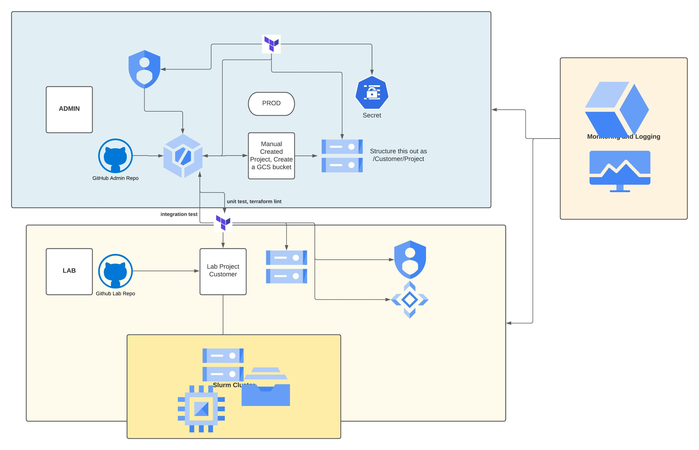

# Walk-through
You can see there are some existing projects created here, each project has its own modules and predefined infrastructure. 
Under the each project folder, you can see the `main.tf` file and its corresponding `nfs_server_startup.sh` file. 
In the main file, there are a few declarations and modules I am referencing from the `../lab` folder and let's walk them through here:
- `provider` block just declares we are using google as the terraform provider
- `terraform` block here defines the backend where the state of the project is stored
- `module "project-factory"` creates the basic project within predefined folder, organization
- `module "service-enablement"` enables services we use in side the aforementioned project
- `module "billing-alert"` sets up a billing alert
- `module "alert-monitoring"` sets up alert on compute and storage
- `module "nfs-server"`sets up a single nfs server instance with compute engine
- `module "filestore-server"` sets up 2 nfs filestore VMs
- `module "slurm-cluster"` sets up the slurm cluster and mounts on the NFS server

The above is how a single project would look like, if we did manually deployed it through `terraform plan` and `terraform apply`, however,
we will use CloudBuild to trigger the build when there is a merge or PR to the master branch. Currently, it is setup to trigger off the Cloud
Source Repo from `lab-common` project, in the future, it will be moved to Github. Essentially these are the steps it will do as CloudBuild:
1. Cloud Build integrates with Github and detect change in the master branch 
2. Cloud Build finds the cloudbuild.yaml file in the root directory `/hpc-lab-samples/cloudbuild.yaml`
3. Concurrently builds and set up mutliple projects based on the YAML definition in the `cloudbuild.yaml` file. 

Refer to this architecture for the admin-lab architecture:

 
---

# Module Description

## Admin 
This folder comprises of modules for enabling Administrative activities. The objective of this folder is to be in-line with least privilege model.  It consists of three modules which are:

| Admin             |
| ----------------- |
| cloudbuild   			|
| secret        		|
| cloud storage 		|

--

### 1.1 cloudbuild
This module is basically setting up a cloudbuild trigger which will set the things up for an admin. The trigger will basically launch "cloudbuild.yaml" file which in turn is doing a terraform apply for lab folder's two modules i.e. service-enablement and landing-zone, The former module of lab folder is basically enabling various APIs required to execute a lab whereas the later on will spin-up the infrastructure required to carry out aimed activities. 

### 1.2 secret
This module is invoking Secret Manager which is a secure and convenient storage system for  sensitive data.

### 1.3 cloud-storage

This module spins up a bucket for the admin project, since it's the beginning of the admin project.

## Lab

The lab folder sets up the landing zone for customers and enable them to spin up the lab infrastructure required for carrying out target activity. The resources like network and their required policies and firewall are spinned-up using these module, beside this, lab folder also provide module on setting budget alert and exporting billing to big query.

| lab                           |
| ----------------------------- |
| alerts-and-monitoring    		|
| billing                 		|
| export-billing			    |
| folder                    	|
| landing-zone               	|
| netapp-cvs                	|
| nfs-server                	|
| project                   	|
| service-enablement        	|
| third_party       		    |
| ----------------------------- |
--
### 2.1 billing*
This module provides alerts on mail at chosen thresholds in terms of forecasted and actual spends on the project for example it can trigger an email alert when budget is exhausted to the  levels like 25%, 50% and 75%.

### 2.2 export-billing*
This module will be exporting billing details via creating a dataset in bigquery for billing analysis purpose.

### 2.3 folder
This module will be creating a folder for individual customer or account. This module is in general meant for one time deployment. **The folder module can be a candidate of Admin folder, might be moved post discussing within the team.**

### 2.4 landing-zone
This module will be providing all the infrastructure required for carrying out activities like creating bucket, adding and binding applicable IAM policies, creating network and setting up firewall rules for IPs  need to be enabled.

### 2.5 netapp-cvs#
This module sets up external storage provided through google market-place (in this case it is NetApp-Cloud Volume Services). Like folder module netapp-cvs module is meant for one time deployment. **This folder may be moved to actual lab instead of landing zone post discussion within the team.**

### 2.6 service-enablement
Service-enablement module is enabling all the services or APIs required to spin up the infrastructure. It's basically meant for automating the APIs enablement process as if one of the API is missed to be enabled can lead to error while spinning resource and individual may need to do the whole process again.
